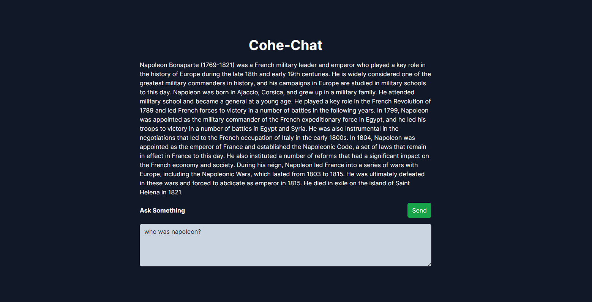

# Chat Application with Artificial Intelligence



## Description

This is a chat application based on artificial intelligence that utilizes Next.js and Cohere to provide an intelligent and personalized conversation experience.

The application allows users to interact with a pre-trained language model from Cohere to get responses to their questions and engage in natural conversations. It's perfect for integration into websites or applications where chatbot functionality is required.

## Features

- Simple and user-friendly chat interface.
- Utilizes an advanced language model from Cohere for intelligent responses.
- Integration with Cohere API to make requests to the model.
- Easy customization and configuration.

## Installation

1. Clone this repository to your local machine.
2. Navigate to the project folder: `cd cohere-aichat`
3. Install the dependencies: `npm install`

## Configuration

1. Obtain an API key from Cohere by signing up on their platform.
2. Copy the API key and paste it into the `.env` file at the root of the project:
   
   ```bash
   COHERE_API_KEY=your_api_key_here
   ```

## Usage

1. Run the application: `npm run dev`
2. Open your browser and go to `http://localhost:3000` to interact with the chat.

## Contribution

If you find any bugs or have ideas to improve the application, feel free to contribute! Just fork the repository, create a branch with your changes, and submit a pull request.
